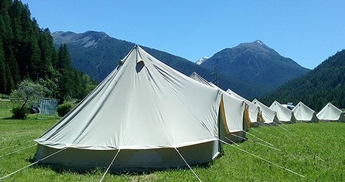

#### CAMPINGS & PARKINGS AGRANDIS ! Plus de 25Ha de terrain au bord du Plan d'eau de Vieure

Le **camping est inclus dans le prix d'entrée du festival**.
Le **placement** est **libre** dans les zones prévues à cet effet.
Le camping se trouve dans l’enceinte du festival, à 10 min à pied de l’entrée et à 5 min des scènes.

Durant le festival, les **camping-cars, camions et vans** pourront se garer sur le **parking** qui leur est dédié, dans la limite des places disponibles et _dans la mesure où les conducteurs n'ont pas l'intention de déplacer leur véhicule durant le festival_.
Il sera également possible d’installer des tentes à proximité de votre camion.

Un **parking voiture** est également prévu à l’**entrée du site** du festival.

______________________

Après le succès rencontré en 2017 par les **Tipi Bell Tents** de "**Typique**" sur la 10ème édition du festival, nous avons choisi d'accueillir à nouveau ce partenaire pour vous proposer une autre vision du camping en festival. 

Vous aimez voyager léger mais appréciez un peu de confort en festival, vous voulez partager cet événement en famille ou entre amis sans jamais vous séparer mais n'avez pas de tente assez grande, vous n'avez pas de tente du tout ? Réservez simplement la tente de votre choix auprès de Typique, rejoignez votre tribu au campement Tipi Bell Tents du festival, posez vos valises et allez danser sans attendre !

Les Tipi Bell Tents sont spacieuses et peuvent loger entre 4 et 8 personnes selon 2 tailles différentes :

- Le Tipi 4m, confortable pour 4 personnes (215 euros pour toute la durée du festival)
- Le Tipi 5m, confortable pour 8 personnes (265 euros pour toute la durée du festival)

Réservez votre tente auprès de Typique à l'adresse suivante en renseignant le type de tente choisie et vos coordonnées : [typiquehadra@gmail.com](mailto:typiquehadra@gmail.com)

