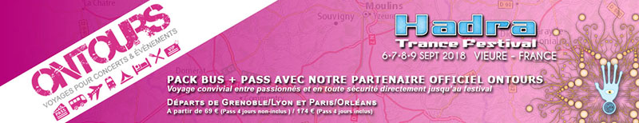

Le festival se déroulera à Vieure, dans le département de l’Allier, au Nord de l’Auvergne.
Le site du festival se trouve au bord du **Plan d’eau de Vieure**.

### Par la route

<iframe ng-if="!offline" src="https://www.google.com/maps/embed?pb=!1m18!1m12!1m3!1d351543.88641214976!2d2.5947436516267013!3d46.49946713979648!2m3!1f0!2f0!3f0!3m2!1i1024!2i768!4f13.1!3m3!1m2!1s0x47f095bc5f3b0617%3A0xfe9754c6cb777592!2s03430+Vieure!5e0!3m2!1sfr!2sfr!4v1466720428320"
        width="100%" height="300" frameborder="0" style="border:0">
</iframe>

#### De Paris, Lille, Bourges, Nantes:
- Suivre direction Bourges
- Sur l’A71, prendre la sortie 10 en direction de Montluçon/Guéret/Cosne d'Allier/Commentry
- Continuer sur A714
- Prendre la sortie en direction de D94
- Rouler en direction de D94 à Vieure
- Suivre le fléchage

#### De Genève (CH), Turin (It), Chambéry, Clermont­-Ferrand, Marseille, Bordeaux, Toulouse:
- Suivre direction Clermont Ferrand, une fois Clermont­-Ferrand passé, suivre Bourges et prendre l’A71
- Sur l’A71, prendre la sortie 10 en direction de Montluçon/Guéret/Cosne d'Allier/Commentry
- Sortie 3 depuis le périphérique de Grenoble pour Sassenage (D1532)
- Aller à Lans­en­Vercors (D531)
- Suivre le fléchage

#### Distance et durée estimée du trajet depuis les principales grandes villes:

*   **Grenoble** ­ Vieure : 357 km, 03h36 estimée.
*   **Lyon** ­ Vieure : 250 km, 2h39 estimée.
*   **Genève** ­ Vieure : 394 km, 4h06 estimées.
*   **St Etienne** ­ Vieure : 230 km, 2h20 estimées.
*   **Clermont­Ferrand** ­ Vieure : 102 km, 1h10 estimées.
*   **Toulouse** ­ Vieure : 454 km, 4h21 estimées.
*   **Bordeaux** ­ Vieure : 452 km, 4h17 estimées.
*   **Paris** ­ Vieure : 345 km, 3h36 estimées.
*   **Rennes** ­ Vieure : 498 km, 4h39 estimées.
*   **Strasbourg** ­ Vieure : 556 km, 5h35 estimées.
*   **Milan** ­ Vieure : 641 km, 6h45 estimées.
*   **Turin** ­ Vieure : 557 km, 5h46 estimées.
*   **Bruxelles** ­ Vieure : 615 km, 6h09 estimées.
*   **Barcelone** ­ Vieure : 716 km, 7h02 estimées.

### En bus

**PACK BUS + PASS AVEC NOTRE PARTENAIRE OFFICIEL ONTOURS**

*Voyage convivial entre passionnés et en toute sécurité directement jusqu’au festival.*

Départs de Grenoble/Lyon et Paris/Orléans

A partir de 69 € (Pass 4 jours non-inclus ) / 174 € (Pass 4 jours inclus)

### Co-voiturage

**L'impact environnemental le plus important lors de notre événement concerne celui des transports, qui représente la majeure part d'émissions de gaz à effet de serre produites.**

Soucieux de ces enjeux, nous essayons de développer au maximum l'utilisation de transports en commun et de covoiturage afin de minimiser et diminuer ces émissions. 

### En train

#### Gares les plus proches

* **Vallon-en-Sully (03)**: 25km
* **Montluçon (03)**: 32 km
* **Moulins (03)**: 40km

<button class="button button-calm button-outline button-small" ng-click="vm.open('http://www.voyages-sncf.com/')">SNCF</button>

**Attention, il n'y a pas de transport public entre ces villes et le site du festival !**

Le stop reste une option. Mais cela peut prendre beaucoup de temps sur les petites routes de l'Allier et ne peut pas être considéré comme 100% sûre. 
Pour tous ceux qui souhaitent venir en train au festival, nous mettons en place des bus-navette en partance le jeudi après-midi depuis la gare Moulins (40 km) et des retours le dimanche après-midi ainsi que le lundi matin pour les retardataires.
