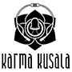
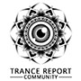
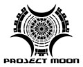
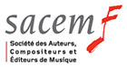
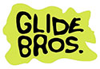

## Festival Harmonic
Cultiver l’harmonie en s’appuyant sur des valeurs universelles, comme celles du respect et de la bienveillance, voilà le sens qui peut imprégner la vision de l’humanité pour colorer ses projets et son avenir, dans les domaines socio-culturel, artistique, environnemental et spirituel. Le festival HARMONIC se veut être une plate-forme de promotion et de rayonnement de cette idée, avec des ateliers (yoga, méditation, danse…) des conférences, un espace bien-être, du spectacle vivant et de la musique électro / acoustique (ambient, dub, downtempo, ethnique…) – écologisme du corps et de l’esprit.

## Etheral Decibel
Ethereal Decibel Company (souvent abrégé « EDC ») est une association loi 1901 fondée à Rennes, qui a pour but la promotion de la culture Psytrance et de ses valeurs, l'organisation de soirées indoor, de festivals,et la production d'artistes locaux et internationaux.
Fondée en 2012, EDC compte à son actif l’organisation d’une trentaine d’évènements sous toutes les formes (soirées privées intérieures/extérieures, clubs, festival outdoor, ainsi qu’un bon nombre de prestations et collaborations auprès d’autres acteurs d’organisation d’événements culturels au niveau local et national : Eclosion festival (49), Hadra Trance Festival (38/03), Rock’n’Solex festival (35) …

## Looney Moon Records
Après avoir fait la promotion des soirées Trance en Italie pendant de nombreuses années, l'illustre équipe de Looney Moon a finalement décidé de diffuser l'ambiance de leurs événements auprès d'un public international. Et quel meilleur moyen aurait pu être choisi que de le faire via la musique ? Looney Moon Records a été fondée en 2008, s'appuyant sur un collectif d'artistes prometteurs et variés dès le premier jour.
Looney Moon dépasse le cadre d'une maison de disques habituelle. Outre les DJ et producteurs talentueux, il représente également le travail d'artistes visionnaires, d'interprètes et de danseurs qui apportent leurs aptitudes et compétences particulières au label.

## Exoria
L’association Exoria a vu le jour en 2013 à Villeurbanne. Dans un premier temps organisatrice d’événements avec une quarantaine de concerts par an, son identité est résolument éclectique.
Exoria est portée par une équipe mixte mêlant scénographes, techniciens lumière & vidéo, développeurs, chargés de production, de programmation, de diffusion & communication, administrateur, ainsi que des porteurs de projets & bénévoles !
Exoria s’est rapidement développée à travers de nouvelles activités :
L’Octopus : Création scénographique dynamique alliant mapping, vjing, show lumière, fabrication et motorisation de décors.
Exo Booking : Lancée en septembre 2017, Exo est une agence de booking d’artistes émergents et en voie de professionnalisation

## Karma Kusala
Karma Kusala est une association de loi 1901 à but non lucratif.
L’association à pour objectifs d’organiser des manifestations musicales et artistiques, de créer du matériel électronique, musical et décoratif pour les manifestations, de produire et promouvoir les artistes adhérents, et d’utiliser les bénéfices des manifestations pour organiser de nouveaux évènements.
Karma Kusala s’articule autour de manifestations artistiques et musicales. Pour mener à bien les manifestations, l’association se divise plusieurs parties complémentaires.
Le but est ainsi d’organiser des concerts et autres manifestations en toute autonomie. Le nom de l’association n’est pas anodin, en effet, Karma Kusala signifie “Action positive” en Hindi. C’est pour cette raison que l’association mènera à bien ses projets dans le respect des autres et de l’environnement. Lors de la création de décoration ou matériel, le recyclage sera par exemple le mot d’ordre principal.

## Trance Report Community
Trance Report Community est avant tout une communauté et un état d'esprit. Basé essentiellement sur le partage et l'échange, nous œuvrons avant tout pour la passion de la musique trance.
L'activité principale concerne la communication et la promotion du milieu trance (Association organisatrice, Artistes, Décorateurs, Labels, etc...), dès l'instant où celles-ci correspondent à nos envies et reflètent nos valeurs. L'un de nos objectifs est de mettre en avant la scène française, trop souvent laissée en arrière-plan, bien qu'elle regorge de professionnels de qualité dans tous les domaines. Nous nous efforçons donc d'étendre un peu plus notre réseau chaque jours, avec l'idée de voir se développer une communauté solidaire. D'autre part, nous travaillons au maximum afin de casser les préjugés qui stigmatisent le milieu, en mettant en avant l'aspect multiculturel accessible à tous.

## Project Moon
L’association Project Moon, basée à Clermont-Ferrand, dans le Puy de Dôme, est créatrice d’événements musicaux électroniques depuis 2011. Spécialisée dans le domaine de la musique Trance, elle est également ouverte à tous les styles de musique électronique (Techno, DNB, Ambient, Dub). L’association promeut le développement et la découverte pour tous des musiques actuelles, des arts plastiques et graphiques régionaux.
Project Moon, c’est également un engagement écologique (ramassage et tri de tous les déchets) afin d’aspirer à un impact neutre sur l’environnement. Grâce à ses multiples partenaires, elle développe des relations, un réseaux et le tissu économique local. L’équipe compte 12 membres dans son conseil d’administration et une quarantaine de membres actifs. Tous passionés et bénévoles, nous organisons des évènements tout au long de l’année avec une jauge variant de 500 à 3000 personnes.

## Dub Camp
L’association Get Up! présente

**DUB CAMP FESTIVAL** > 19-22 juillet 2018 > Lac de Vioreau / Joué-sur-Erdre

Rendez-vous majeur de la culture Sound System en Europe, le Dub Camp Festival propose en extérieur les meilleurs Sound Systems français et internationaux !
Pour cette cinquième édition, l'association Get Up s'attache à proposer aux festivaliers une programmation riche et variée, représentative de tous les courants et styles issus de la culture Reggae/Dub et du mouvement Sound System.
Durant 4 jours se succéderont sous les chapiteaux le top des acteurs frenchy ainsi que la crème de la scène internationale !
All Tribes are Welcome !
[www.dubcampfestival.com](http://www.dubcampfestival.com)

----------------

